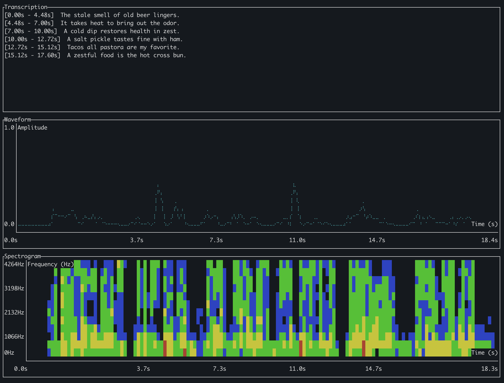

# Fourrier-rs

A Rust-based audio visualization tool that provides waveform visualization, spectrogram analysis, and speech transcription in your terminal.



## Features

- Audio file loading (supports WAV and MP3)
- Waveform visualization
- Spectrogram analysis
- Speech transcription using OpenAI's Whisper model
- Terminal-based UI with color support

## Prerequisites

1. Rust and Cargo (latest stable version)
2. Whisper model file - download the base model:
```bash
wget https://huggingface.co/ggerganov/whisper.cpp/resolve/main/ggml-base.bin -O whisper-base.bin
```

## Installation

1. Clone the repository
2. Download the Whisper model as shown above
3. Build the project:
```bash
cargo build --release
```

## Usage

Run the program with an audio file:

```bash
cargo run --release -- -i path/to/your/audio.mp3
```

Optional parameters:
- `-w, --window-size`: FFT window size for spectrogram (default: 1024)

## Controls

- Press 'q' to quit the visualization

## Display

The visualization is split into three sections:
1. Transcription with timestamps
2. Waveform visualization
3. Spectrogram display

## License

MIT 